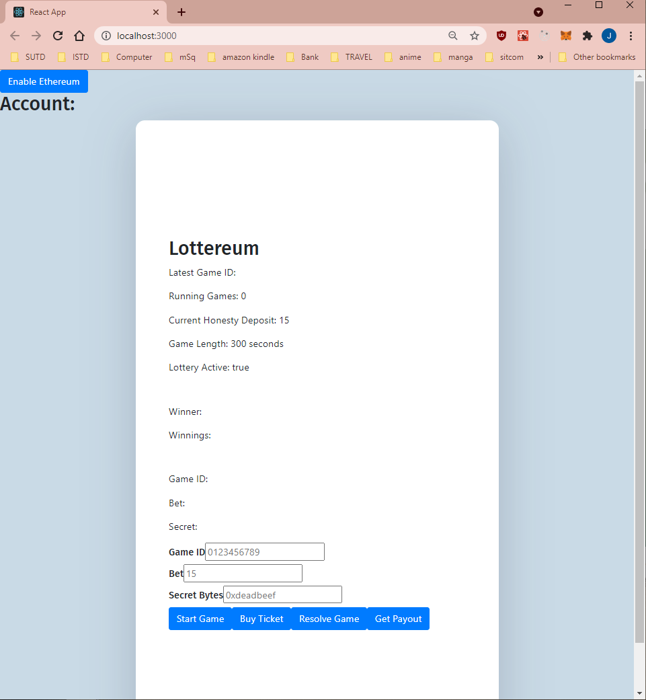
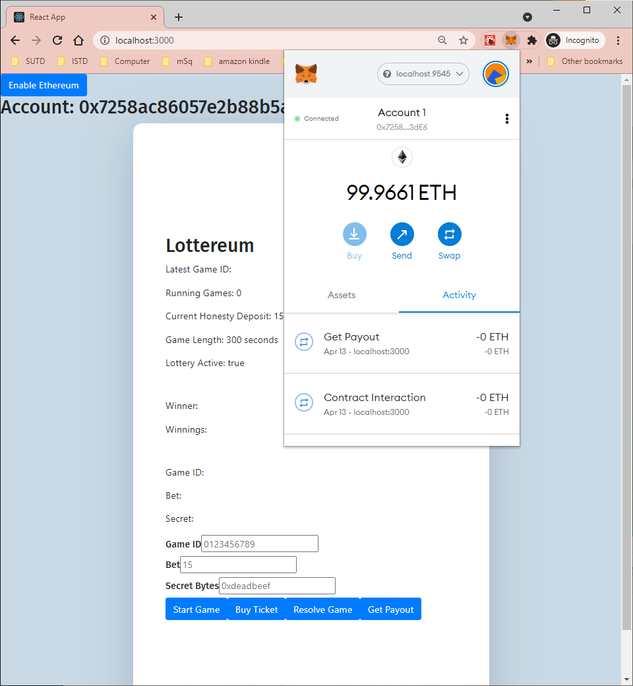
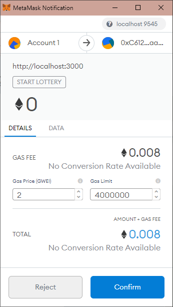
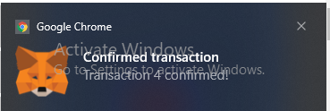
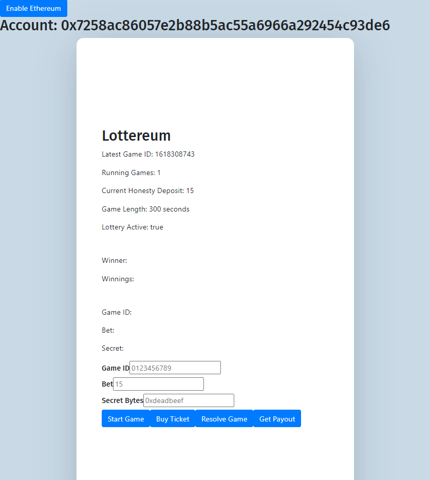
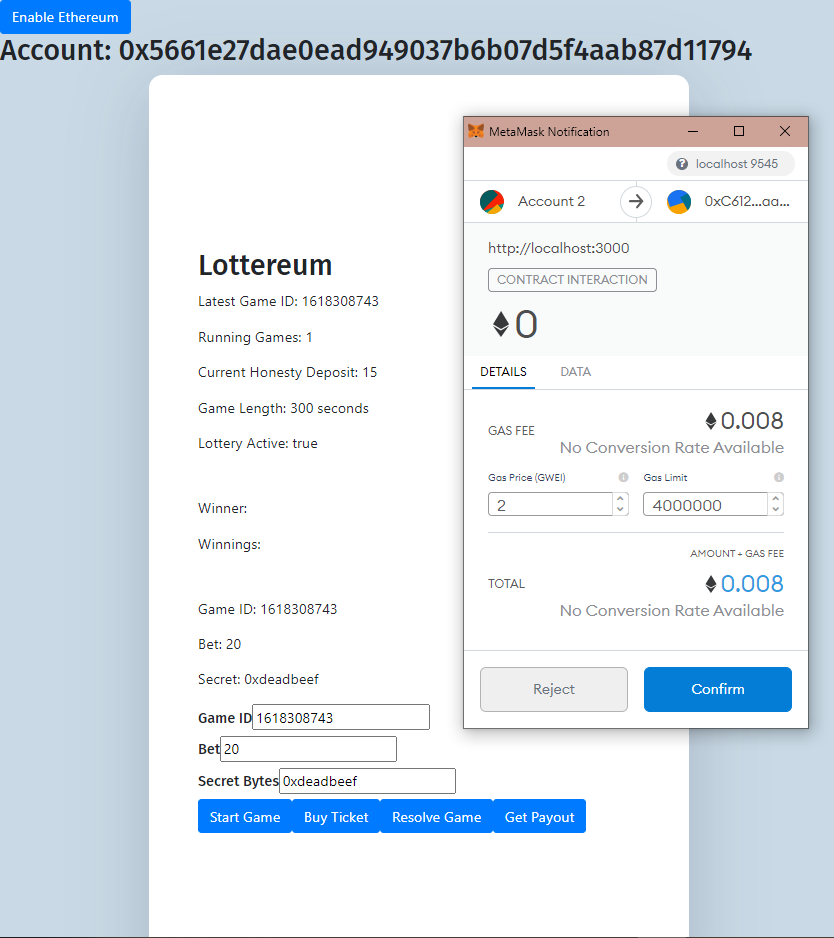
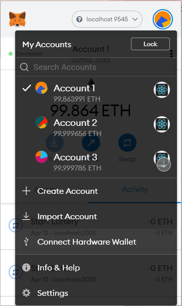
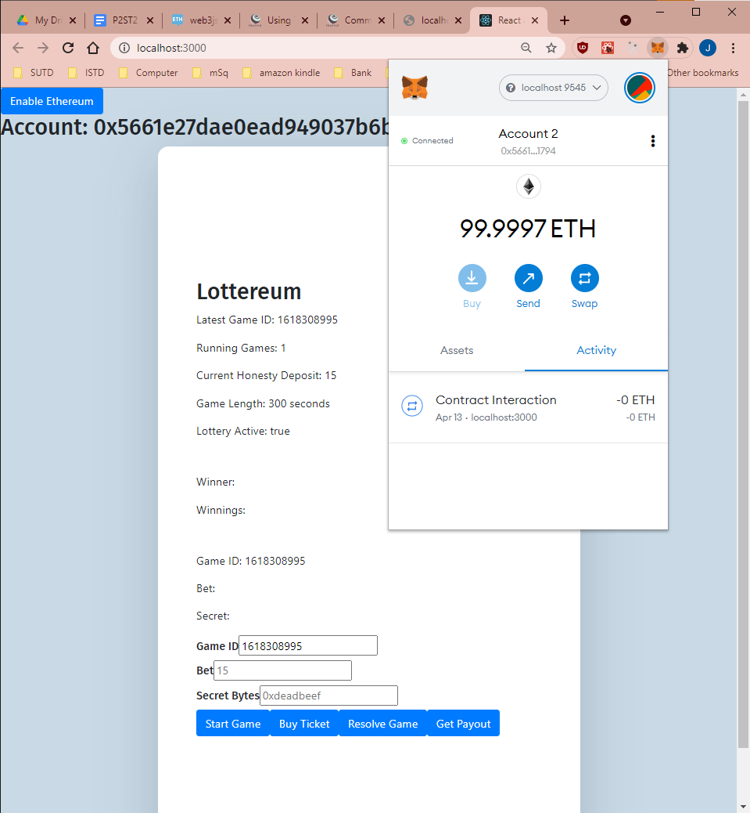
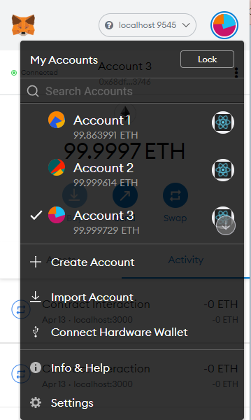
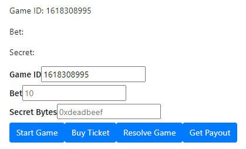

# ST2 Lottereum for ST2

## Dependencies

> This program was run on Windows. The guide will detail in Windows perspective:

1. Install [WSL](https://docs.microsoft.com/en-us/windows/wsl/install-win10)
2. Install [npm](https://gist.github.com/noygal/6b7b1796a92d70e24e35f94b53722219) in WSL
3. Install [truffle](https://www.npmjs.com/package/truffle) in WSL

```bash
npm install truffle -g
```

4. Install [MetaMask](https://chrome.google.com/webstore/detail/metamask/nkbihfbeogaeaoehlefnkodbefgpgknn?hl=en) (Version 9.3.0 as of 13 Apr 2021) on Google Chrome (Version 89.0.4389.114 (Official Build) (64-bit))

## Running in development

1. Install dependencies before proceeding
2. Navigate to the project file (hereinafter called `$LOTTEREUM_DIR`)
3. Compile the project with `truffle compile`
4. Host the smart contract in development with `truffle develop`
5. Migrate the smart contract with `truffle migrate`
6. Then, we host the frontend server, as found at this [github link](https://github.com/jeremyng123/lottereum_frontend)  
      
   From this image, we can see the default values that the Lottery will begin with:

   - Current Honesty Deposit = 15,
   - Game Length = 300 seconds (or 5 minutes)
   - Lottery status = Active

7. Login to the site using MetaMask. A button has been included in the top left of the page for easy login.  
   We can see that that that the public key of the account that is logged in will be displayed for development purpose:

   

8. We may use this account to start a lottery game, by merely click on the Start game button. A MetaMask pop up window will appear. Click on Confirm to accept the gas costs displayed, as per in this screenshot:
     
   After which, we can see this notification when a successful TX was made:  
   
9. We can now see the updated page to reflect the lottery that is being hosted:
   
10. Use another account to make bets to that lottery. An example of what values to fill in each fields can be seen:
      
    After the punter is happy with the values, he/she may click on Buy Ticket button to purchase a bet ticket. Of course, once the transaction is successful, a notification will appear. Do this for one more account (so we have more than 1 punters). Then, we wait for 5 minutes for the house to resolve game and retrieve payout.

Using Metamask, we can see the results of the punting using 2 different accounts:  
 

11. Using accounts 2 and 3, click on resolve game button after filling in the game ID field box. This can be seen in this image:  
       
    After resolving the games from the 2 accounts, we note that the deposit has been returned to them (compare the prices from this image and the previous one):  
    

12. Afterwards, use Account 2 to click on Get Payout, making sure that the Secret Bytes value is the same as the input when buying ticket. Do the same for account 3.

13. After that, use Account 1 (the house) to get payout. The immediate effect is the decrease in the minimum bet amount:  
    

14. We can then see that Account 3 is the winner because it now has more eth in his wallet:
